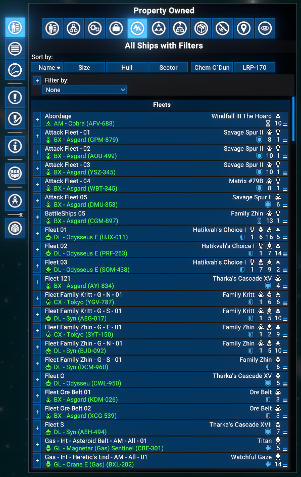

# All Ships with Filters

Adds an **All Ships with Filters** tab to the **Property Owned** menu in the map. The tab shows all owned ships in three sections: **Fleets**, **Stations with Assigned Ships** (subordinate ships only, without module or construction rows), and **Unassigned Ships**. Supports multi-dimensional filtering by ship type, size, sector, dock status, default behaviour, current order, and failed orders.

## Features

- **All Ships tab**: A dedicated tab in the Property Owned menu lists every owned ship in three sections - Fleets, Stations with Assigned Ships, and Unassigned Ships - using the same ship rows as the vanilla view (hull bars, action buttons, sub-expansion).
- **Stations section**: Shows only the subordinate ships assigned to each station, hiding module and construction rows for a cleaner list.
- **Multi-dimensional filtering**: Add up to one filter per available dimension. Each filter row has a category dropdown and, once a category is selected, a value dropdown. Multiple filter slots appear automatically; remove a slot by setting its category back to None.
- **Filter dimensions**: **Type** (ship purpose), **Size** (hull class), **Sector**, **Docked** (yes/no), **Default Behaviour**, **Current Order**, **Failed Orders**.
- **Fleet handling**: A fleet is shown whenever the fleet commander or at least one subordinate passes the active filters. Fleet unit group entries are always preserved so the expand/collapse button remains functional.
- **Expand/collapse all**: When the list contains expandable entries (fleets or stations with subordinates), a master +/- button appears in the filter header row to expand or collapse all at once.
- **Compatible with X4 8.00 and 9.00**.

## Requirements

- **X4: Foundations**: Version **8.00HF4** or higher and **UI Extensions and HUD**: Version **v8.0.4.x** or higher by [kuertee](https://next.nexusmods.com/profile/kuertee?gameId=2659):
  - Available on Nexus Mods: [UI Extensions and HUD](https://www.nexusmods.com/x4foundations/mods/552)
- **X4: Foundations**: Version **9.00 beta 3** or higher and **UI Extensions and HUD**: Version **v9.0.0.0.3** or higher by [kuertee](https://next.nexusmods.com/profile/kuertee?gameId=2659).
- **Mod Support APIs**: Version 1.95 or higher by [SirNukes](https://next.nexusmods.com/profile/sirnukes?gameId=2659):
  - Available on Steam: [SirNukes Mod Support APIs](https://steamcommunity.com/sharedfiles/filedetails/?id=2042901274)
  - Available on Nexus Mods: [Mod Support APIs](https://www.nexusmods.com/x4foundations/mods/503)
- **Options Helper**: Version 1.0 or higher by [Chem O`Dun](https://next.nexusmods.com/profile/ChemODun/mods?gameId=2659):
  - Available on Steam: [Options Helper](https://steamcommunity.com/sharedfiles/filedetails/?id=3715253556)
  - Available on Nexus Mods: [Options Helper](https://www.nexusmods.com/x4foundations/mods/2089)

## Installation

- **Steam Workshop**: [All Ships with Filters](https://steamcommunity.com/sharedfiles/filedetails/?id=0)
- **Nexus Mods**: [All Ships with Filters](https://www.nexusmods.com/x4foundations/mods/0)

## Usage

Open the map, switch to the **Property Owned** panel, and click the **All Ships with Filters** tab in the tab strip.

### Filter rows

The top of the tab contains one or more **filter rows**. Each row has:

- A **category dropdown** - choose the dimension to filter by (Type, Size, Sector, Docked, Default Behaviour, Current Order, Failed Orders). Setting this back to None removes only that slot; the remaining slots are preserved. Changing it to a different category removes all slots after it, since their value selections may no longer be meaningful.
- A **value dropdown** - appears once a category is chosen; select the specific value to match. Choosing None here shows all ships regardless of that dimension's value.

Additional filter slots appear automatically when all existing slots have an active category. All active filters are applied simultaneously (AND logic).

### Expand/collapse all

When the ship list contains expandable entries (fleet leaders or stations with subordinates), a **+/-** button appears in the filter header row. Clicking it expands or collapses every expandable entry at once.

### Sections

- **Fleets**: Fleet leaders and their subordinates. A fleet is visible if the commander or any subordinate passes the filter.
- **Stations with Assigned Ships**: Stations that have at least one assigned ship passing the filter, showing only the subordinate ships.
- **Unassigned Ships**: Ships not assigned to a fleet or station, filtered by the active filter.

### Extension options

**Options Menu > Extension options > All Ships with Filters**:

- **Debug mode**: Controls log verbosity. Options: None (default), Debug, Trace. Use Debug or Trace only when troubleshooting - these write to the game log on every refresh.

## Credits

- **Author**: Chem O`Dun, on [Nexus Mods](https://next.nexusmods.com/profile/ChemODun/mods?gameId=2659) and [Steam Workshop](https://steamcommunity.com/id/chemodun/myworkshopfiles/?appid=392160)
- *"X4: Foundations"* is a trademark of [Egosoft](https://www.egosoft.com).

## Acknowledgements

- [EGOSOFT](https://www.egosoft.com) - for the X series.
- [kuertee](https://next.nexusmods.com/profile/kuertee?gameId=2659) - for the `UI Extensions and HUD` that makes this extension possible.
- [SirNukes](https://next.nexusmods.com/profile/sirnukes?gameId=2659) - for the `Mod Support APIs` that power the UI hooks and options menu.

## Changelog

### [8.00.01] - 2026-04-28

- **Added**
  - Initial public version.
